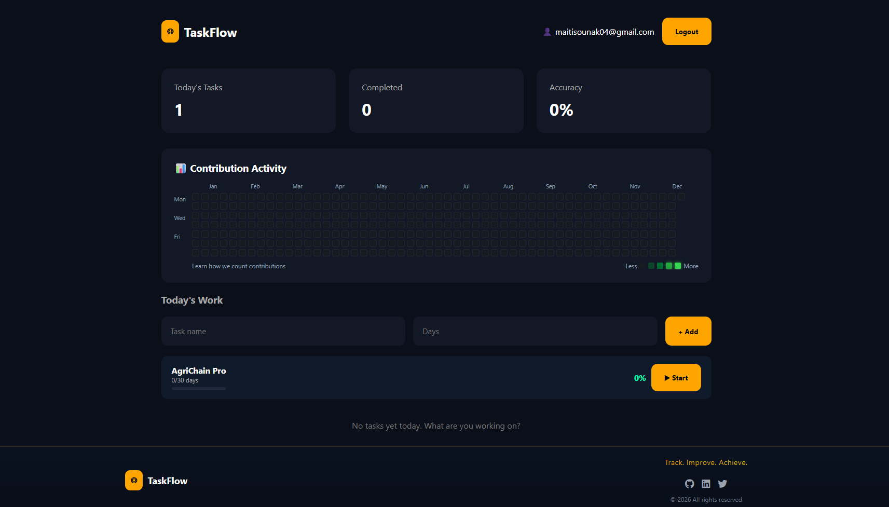
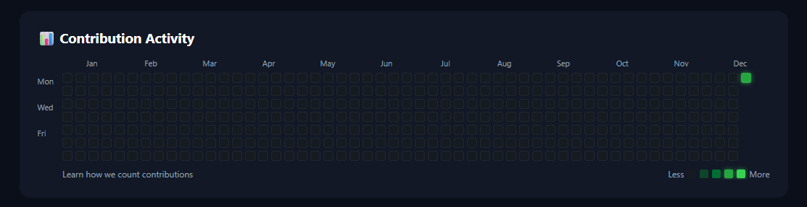
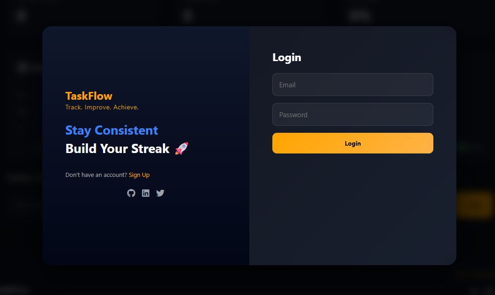

# 🚀 TaskFlow — Smart Productivity Tracker

<p align="center">
  <b>Track • Improve • Achieve</b><br>
  A modern full-stack productivity app with GitHub-style streak tracking.
</p>

---

## 🏷️ Badges


---

## 📌 Overview

**TaskFlow** is a full-stack productivity web application designed to help users manage daily tasks, track consistency, and visualize progress using a **GitHub-style contribution heatmap**.

It focuses on building habits, maintaining streaks, and improving productivity through visual feedback.

---

## ✨ Features

* ✅ Task management system
* 🔥 GitHub-style streak heatmap
* 📊 Daily productivity tracking
* 🎯 Accuracy & completion metrics
* 🔐 Authentication (Login / Signup UI)
* 🎨 Modern UI with animations

---

## 🖼️ Screenshots

### 📊 Dashboard



### 🔥 Contribution Heatmap



### 🔐 Login UI



### 🆕 Signup UI


---

## 🛠️ Tech Stack

### 💻 Frontend


---

### ⚙️ Backend


---

### 🗄️ Database


---

### 🧰 Tools & Platforms


---

## 📂 Project Structure

```
smart-todo-app/
│
├── backend/
│   ├── public/
│   │   ├── index.html
│   │   ├── style.css
│   │   └── script.js
│   ├── server.js
│   ├── Task.js
│   ├── User.js
│   └── package.json
│
├── assets/
│   ├── dashboard.png
│   ├── heatmap.png
│   ├── login.png
│   └── signup.png
│
├── .gitignore
└── README.md
```

---

## ⚙️ Installation

### 1️⃣ Clone the repository

```
git clone https://github.com/sounakmaiti123/smart-todo-app.git
cd smart-todo-app
```

### 2️⃣ Install dependencies

```
cd backend
npm install
```

### 3️⃣ Setup environment variables

Create a `.env` file:

```
MONGO_URI=your_mongodb_uri
PORT=5000
```

### 4️⃣ Run the application

```
node server.js
```

---

## 🌐 Usage

* Open: `http://localhost:5000`
* Add tasks
* Track streaks
* Monitor progress

---

## 🚀 Future Enhancements

* 📱 Mobile responsiveness
* 🔔 Notifications & reminders
* ☁️ Deployment (Render / Vercel)
* 📊 Advanced analytics

---

## 👨‍💻 Author

**Sounak Maiti**

* GitHub: https://github.com/sounakmaiti123

---

## ⭐ Support

If you like this project:

⭐ Star the repo
🍴 Fork it
🚀 Share it

---

## 💡 Inspiration

Inspired by GitHub contribution graph and modern productivity tools.
